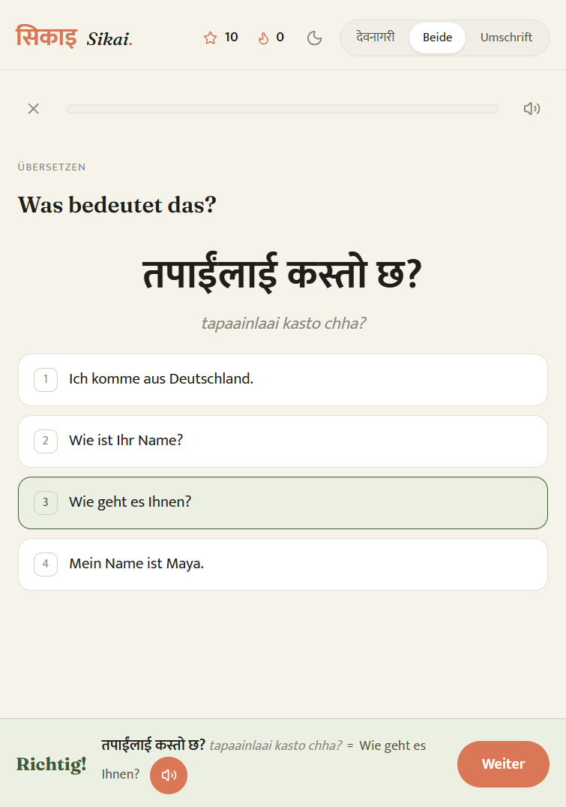

<div align="center">

[Deutsch](README.md) · **English**

# Sikai · सिकाइ

**Learn Nepali — as a journey from Kathmandu to Everest Base Camp.**

[](https://dominikwoh.github.io/Sikai/)

<a href="https://dominikwoh.github.io/Sikai/"></a>

**Scan the QR · open in the browser · install as an app** — after that it runs fully offline.

[](https://dominikwoh.github.io/Sikai/)
[](#tech-in-brief)
[](#structure)
[](#tech-in-brief)


9 chapters of story · vocabulary trainer with Devanagari + transliteration · XP, streaks and a travel passport with stamps — for anyone who wants to go from zero to a small conversation in Nepali. UI in German and English, every word with translation.

*Auf Deutsch lernen — von Kathmandu zum Everest Base Camp, in 9 Kapiteln. Kostenlos, installierbar, komplett offline nutzbar.*

</div>

---

## Install as an app (then it works fully offline)

- **Android (Chrome):** open the site → menu · · · → **“Install app”** — or just tap the hint on your first visit.
- **iPhone (Safari):** Share button → **“Add to Home Screen”**.

On first open, the entire app is stored on your device — all chapters, exercises and audios (~5 MB). After that, Sikai works without any internet connection. Progress (XP, streak) stays in each device's browser.

## What's inside

- **The journey:** 9 stops from Kathmandu via Nagarkot, Pokhara, Lumbini and Chitwan to Everest Base Camp — each with its own story, scenes and choices.
- **Topic packs:** 8 vocabulary packs alongside the journey (Family & Age, Body & Health, Colors & Weather, Jobs & Work, Food & Hospitality, Telling the Past, Farewell & Reunion, Everyday & Time) — they unlock once you have mastered half the journey (16 of 31 scenes).
- **Vocabulary trainer:** 320 words & sentences with Devanagari, transliteration and pronunciation audio; spaced repetition for review.
- **Motivation:** daily goal (1 new scene + 1 review), streak, XP, travel passport with stamps, daily challenge.
- **Extras:** Devanagari letter course, listening dictation (“detective”), listening multiple-choice, sentence building.

<p align="center">
  
  <br><em>Live in the app: translating with Devanagari + transliteration, pronunciation audio, instant feedback.</em>
</p>

## Run locally

The app is purely static — no build step, no server required:

```bash
python -m http.server 8765
# then open http://localhost:8765
```

## Tech in brief

- Vanilla HTML/CSS/JS, zero dependencies, zero external requests (fonts embedded locally). Regular selftest with 132 checks (`?demo=selftest`).
- `sw.js` (service worker) precaches all ~390 files including the 341 audio files; a script generates it from the file tree, with a content hash as the build id. Whenever content changes it is regenerated — installed apps pick up the new version automatically (update banner).
- Manifest + icons for Android/iOS; relative paths, so everything also works under a GitHub Pages subpath.

## Structure

```
index.html        App shell (tabs: Home · Topics · Practice · Settings)
app.js            Learning engine: story, SRS, XP, streak, quiz types, PWA logic
styles.css        Design (light/dark, warm & calm, Devanagari-capable fonts)
data/             Chapters 1–9 + base lesson + topic packs
assets/           Icons (Lucide) + fonts (Fraunces, Mukta — local)
audio/            341 MP3 pronunciation files
manifest.json     PWA manifest   ·   sw.js   service worker (generated)
```
