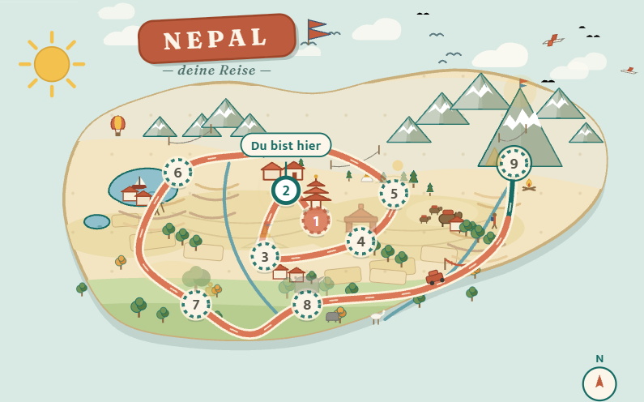

<div align="center">

# Sikai · सिकाइ

**Nepali lernen — als Reise von Kathmandu zum Everest Base Camp.**

[](https://dominikwoh.github.io/Sikai/)

<a href="https://dominikwoh.github.io/Sikai/"></a>

**QR scannen · im Browser öffnen · als App installieren** — läuft danach komplett offline.

[](https://dominikwoh.github.io/Sikai/)
[](#technik-kurzfassung)
[](#struktur)
[](#technik-kurzfassung)



9 Kapitel Geschichte · Vokabeltrainer mit Devanagari + Umschrift · XP, Streak und Reise-Pass mit Stempeln — für alle, die Nepali von null auf „kleines Gespräch“ lernen wollen, komplett auf Deutsch.

</div>

---

## Als App installieren (funktioniert dann komplett offline)

- **Android (Chrome):** Seite öffnen → Menü · · · → **„App installieren“** — oder einfach den Hinweis beim ersten Öffnen antippen.
- **iPhone (Safari):** Teilen-Taste → **„Zum Startbildschirm hinzufügen“**.

Beim ersten Öffnen speichert sich die gesamte App auf dem Gerät — alle Kapitel, Übungen und Audios (~3 MB). Danach funktioniert Sikai ohne jede Internetverbindung. Fortschritt (XP, Streak) liegt lokal im Browser des jeweiligen Geräts.

## Was drin ist

- **Die Reise:** 9 Stationen von Kathmandu über Nagarkot, Pokhara, Lumbini und Chitwan bis zum Everest Base Camp — jede mit eigener Geschichte, Szenen und Entscheidungen.
- **Vokabeltrainer:** 162 Wörter & Sätze mit Devanagari, Umschrift und Aussprache-Audio; Auffrischen per Spaced Repetition.
- **Motivation:** Tagesziel (1 neue Szene + 1 Wiederholung), Streak, XP, Reise-Pass mit Stempeln, tägliche Challenge.
- **Extras:** Devanagari-Buchstabenkurs, Hördiktat („Detektiv“), Hören-Multiple-Choice, Satz-Bau.

## Lokal starten

Die App ist rein statisch — kein Build, kein Server nötig:

```bash
python -m http.server 8765
# dann http://localhost:8765 öffnen
```

## Technik (Kurzfassung)

- Vanille HTML/CSS/JS, keine Abhängigkeiten, keine externen Anfragen (Fonts lokal eingebettet). Regulärer Selbsttest mit 98 Checks (`?demo=selftest`).
- `sw.js` (Service Worker) precacht alle ~230 Dateien inkl. der 183 Audio-Dateien; er wird per Skript aus dem Dateibaum generiert und trägt einen Inhalts-Hash als Build-Kennung. Bei Inhaltsänderungen wird er neu generiert — installierte Apps laden die neue Version dann automatisch nach (Update-Banner).
- Manifest + Icons für Android/iOS; relative Pfade, damit alles auch unter einem GitHub-Pages-Unterpfad läuft.

## Struktur

```
index.html        App-Shell (Tabs: Start · Üben · Einstellungen)
app.js            Lern-Engine: Story, SRS, XP, Streak, Quiz-Typen, PWA-Logik
styles.css        Design (hell/dunkel, warm & ruhig, Devanagari-taugliche Fonts)
data/             Kapitel 1–9 + Basislektion
assets/           Icons (Lucide) + Fonts (Fraunces, Mukta — lokal)
audio/            183 MP3-Aussprachedateien
manifest.json     PWA-Manifest   ·   sw.js   Service Worker (generiert)
```
